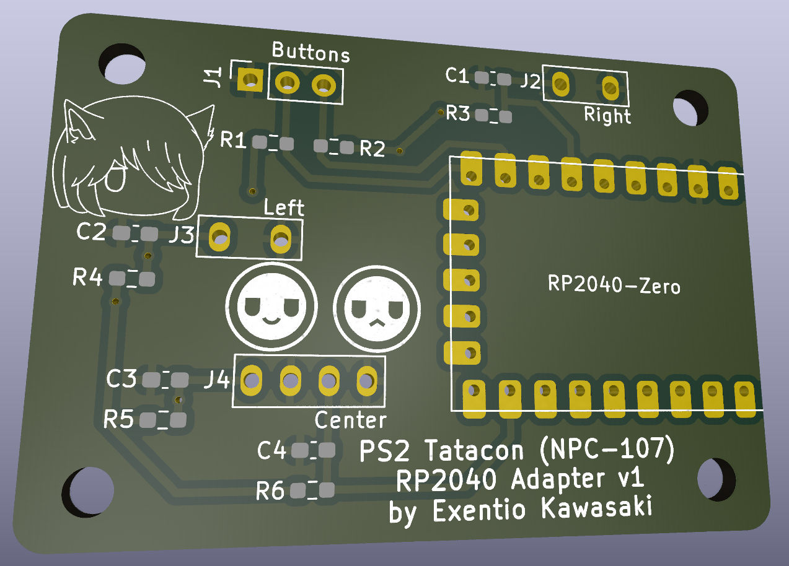

# PS2 Tatacon RP2040 converter
---

Replacement PCB for the PS2 Tatacon (NPC-107) using the Waveshare RP2040-Zero.  
The recommended firmware is GP2040-CE, which provides sub-ms input lag and
allows to use it with both PC and many consoles. The used pins are as follow:  

| Controller Input | RP2040 Pin |
|------------------|------------|
| Right Don        | 7          |
| Left Don         | 8          |
| Right Ka         | 27         |
| Left Ka          | 26         |
| Start            | 14         |
| Select           | 15         |

